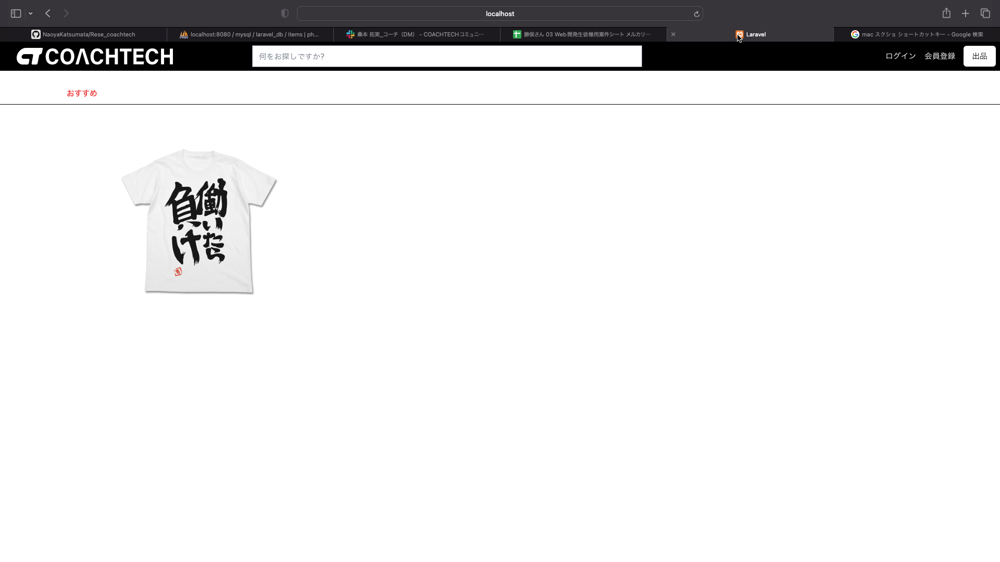
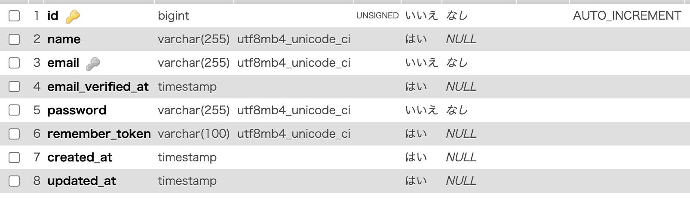
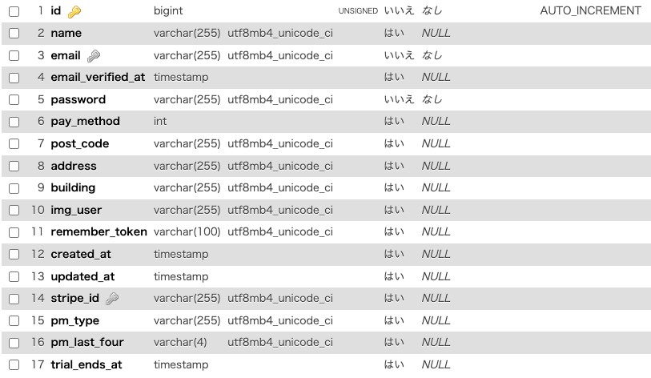
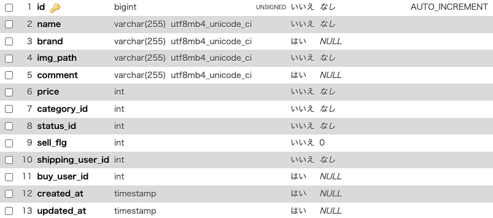
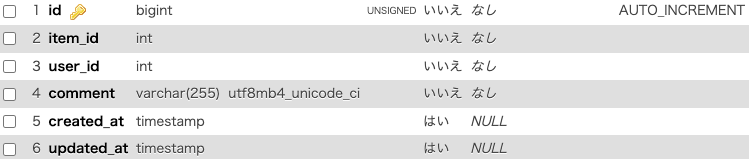
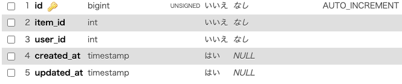
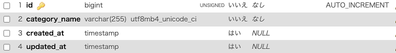
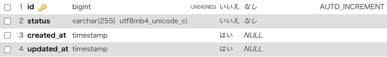
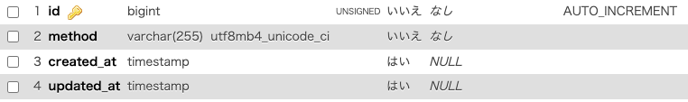
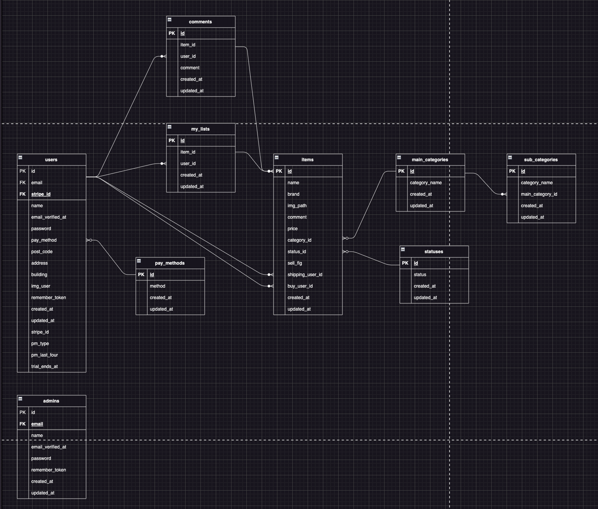

# fleaMarket
<h1>coachtechフリマサービス</h1>

<h1>概要</h1>

ある企業が開発した独自のフリマアプリ

<h1>githubリンク</h1>

https://github.com/NaoyaKatsumata/fleaMarket

<h1>機能</h1>
<ul>
    <li>ユーザ会員登録</li>
    <li>ユーザログイン</li>
    <li>ログアウト</li>
    <li>商品一覧表示</li>
    <li>商品詳細取得</li>
    <li>商品お気に入り一覧表示</li>
    <li>ユーザ情報表示</li>
    <li>ユーザ購入商品一覧表示</li>
    <li>ユーザ出品商品一覧表示</li>
    <li>プロフィール変更</li>
    <li>商品お気に入り追加</li>
    <li>商品お気に入り削除</li>
    <li>商品コメント追加</li>
    <li>出品</li>
    <li>商品購入</li>
    <li>管理者登録</li>
    <li>管理者ログイン</li>
    <li>ユーザ削除</li>
    <li>管理者からのメール送信</li>
    <li>商品コメント削除</li>
</ul>
<h1>使用技術</h1>
<ul>
    <li>laravel：9.52.16</li>
    <li>php：8.1.29</li>
    <li>composer：2.7.9</li>
    <li>DB：Mysql</li>
</ul>
<h1>テーブル設計</h1>

adminsテーブル

usersテーブル

itemsテーブル

commentsテーブル

my listsテーブル

main_categoriesテーブル

sub_categoriesテーブル

statusesテーブル

pay methodsテーブル

<h1>ER図</h1>
