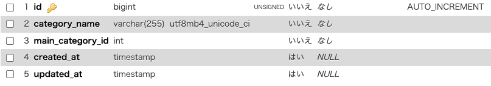

# fleaMarket
<h1>coachtechフリマサービス</h1>

<h1>概要</h1>

ある企業が開発した独自のフリマアプリ

<h1>githubリンク</h1>

https://github.com/NaoyaKatsumata/fleaMarket

<h1>機能</h1>
<ul>
    <li>ユーザ会員登録</li>
    <li>ユーザログイン</li>
    <li>ログアウト</li>
    <li>商品一覧表示</li>
    <li>商品詳細取得</li>
    <li>商品お気に入り一覧表示</li>
    <li>ユーザ情報表示</li>
    <li>ユーザ購入商品一覧表示</li>
    <li>ユーザ出品商品一覧表示</li>
    <li>プロフィール変更</li>
    <li>商品お気に入り追加</li>
    <li>商品お気に入り削除</li>
    <li>商品コメント追加</li>
    <li>出品</li>
    <li>商品購入</li>
    <li>管理者登録</li>
    <li>管理者ログイン</li>
    <li>ユーザ削除</li>
    <li>管理者からのメール送信</li>
    <li>商品コメント削除</li>
</ul>
<h1>使用技術</h1>
<ul>
    <li>laravel：9.52.16</li>
    <li>php：8.1.29</li>
    <li>composer：2.7.9</li>
    <li>DB：Mysql</li>
</ul>
<h1>テーブル設計</h1>

adminsテーブル

usersテーブル

itemsテーブル

commentsテーブル

my listsテーブル

main_categoriesテーブル

sub_categoriesテーブル

statusesテーブル

pay methodsテーブル

<h1>ER図</h1>

<h1>環境構築</h1>
<ul>
    <li>githubからファイルをローカルへ 
        　URL->https://github.com/NaoyaKatsumata/fleaMarket
    </li>
    <li>クローンしたフォルダに移動</li>
    <li>dockerが起動しているのを確認し、ビルド 
        　docker-compose up -d --build
    </li>
    <li>composerをインストール 
        　docker-compose exec php bash composer install
    </li>
    <li>.envファイルをコピーし編集 
        　cp .env.example .env 
        　nano .env 
        　(テキストエディタがない場合はインストール) 
        　apt install nano 
        　.env編集箇所 
        　DB_CONNECTION=mysql 
        　DB_HOST=mysql 
        　DB_PORT=3306 
        　DB_DATABASE=laravel_db 
        　DB_USERNAME=laravel_user 
        　DB_PASSWORD=laravel_pass 
         
        　MAIL_MAILER=smtp 
        　MAIL_HOST=smtp.gmail.com 
        　MAIL_PORT=587 
        　MAIL_USERNAME=naoyakatsumata0708@gmail.com 
        　MAIL_PASSWORD="sjkm dwkn ihjx fxvy" 
        　MAIL_ENCRYPTION=tls 
        　MAIL_FROM_ADDRESS=naoyakatsumata0708@gmail.com 
        　MAIL_FROM_NAME="${APP_NAME}" 
         
        　STRIPE_SECRET_KEY=sk_test_51Ps2R304yADrhrdliSOQHA8tHEQrJRi6ejYIDgEJM49iejC8SmPDLnNOSE30RWqnskznliIrnexhoBk7c69G1FCg00PqIK8exV 
        　STRIPE_PUBLIC_KEY=pk_test_51Ps2R304yADrhrdltk3Z2vMblFDpOPnzktddDa2fvNQ7pFd05FGnIMGDMjQ1gvjO7d5cM7ZOwmQ4EX8dZcaEQtg700b4nDnti8
        </li>
        <li>keyの作成 
        　php artisan key:generate
        </li>
        <li>npmのインストール 
        コンテナから出る 
        　exit 
        srcに移動 
        　cd src 
        npmをインストール 
        　npm install
        </li>
        <li>npmを起動
        　npm run dev</li>
        <li>ダミーデータの投入 
        　docker-compose exec php bash 
        　php artisan migrate 
        　php artisan db:seed</li>
        <li>ストレージとリンク 
        　php artisan storage:link</li>
        <li>ユーザの作成 
        　ユーザの作成・ログインはナビゲーションから 
        　管理者の作成->http://localhost/admin/register 
        　　　ログイン->http://localhost/admin/login</li>
</ul>